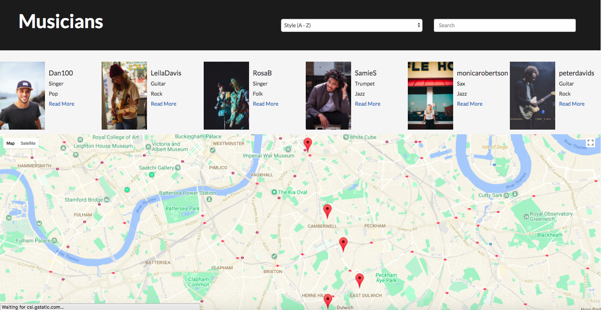
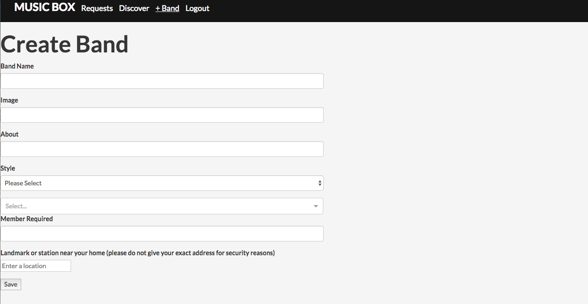

# WDI Project 4: MERN Stack - 'Music Box'

* Cover Page.

* Search for musicians in your area. 

* Search for bands in your area.

* View further information on each band, check out their vacancies.

* Request to join - The creator of the band receives your request and can accept or reject the offer.

* Create a band.

## Summary

For my final project I built a MERN stack app for users to find other musicians or bands to play with in their local area. I came up with the idea because I play several instruments and when I moved to London about a year ago it would have been a really useful tool to find other musicians and make new friends with similar interests. 

I enjoyed using React on the front end because I like how modular it is.  I like the way the JSX and functions for that component are in the same place and can then be easily reused. I also like the way I can use JS on both the server and client side as I want to further my knowledge of the language. 

I utilised the google maps and google maps and google places API to mark the musicians and bands locations. Follow links to their profile page and filter by style, location and members required. 

## Technologies

* Mongo, Express, ReactJS, Node.js
* JSX
* JavaScript
* HTML5
* CSS3
* SASS
* Google Places API
* Google Maps API
* Bootstrap
* webpack

